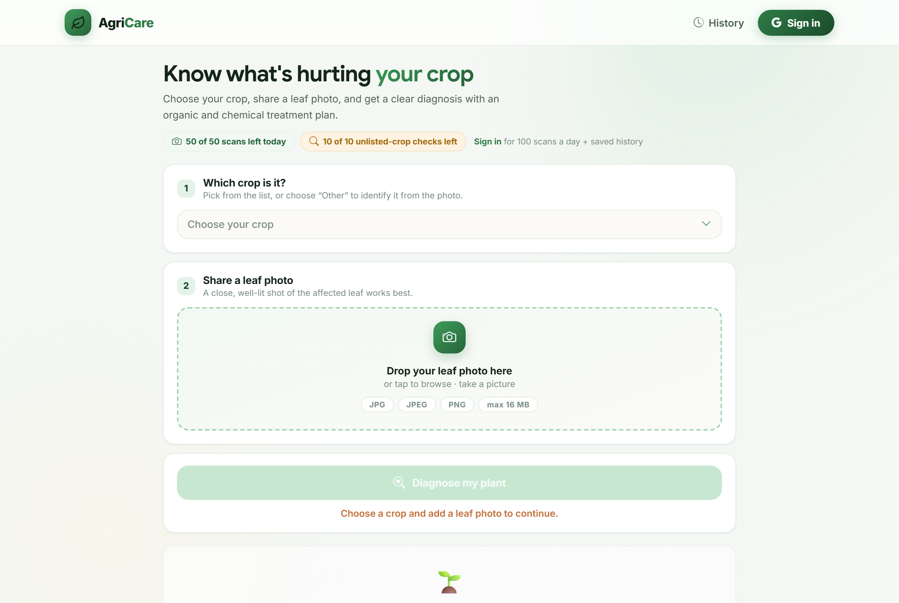
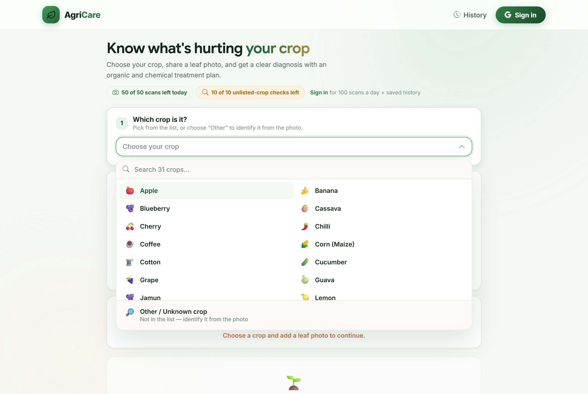
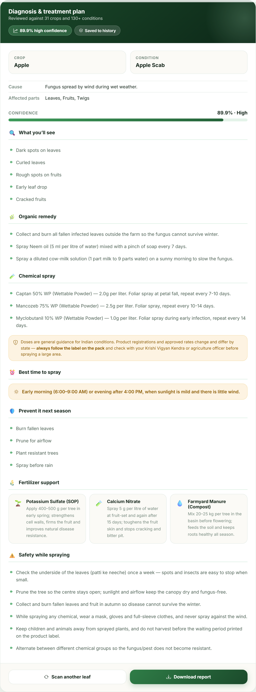
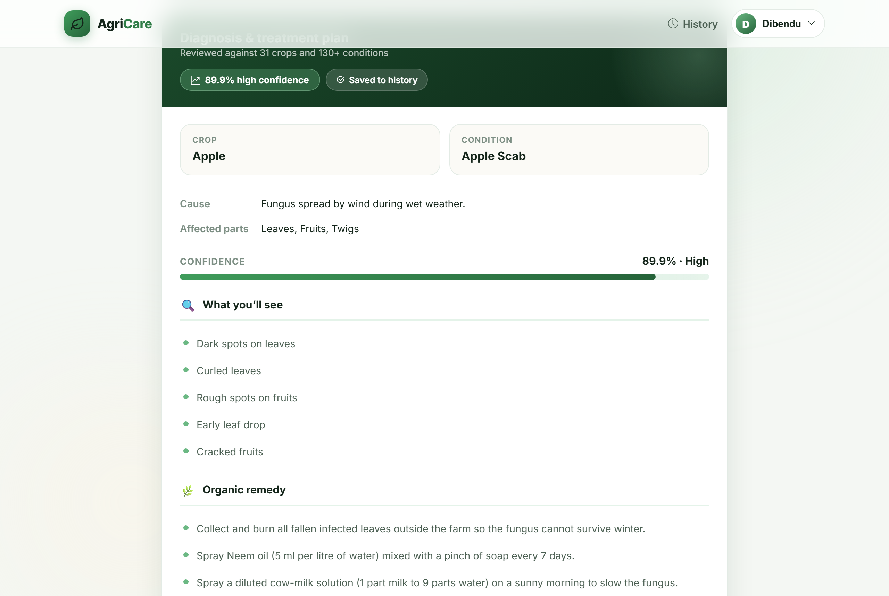
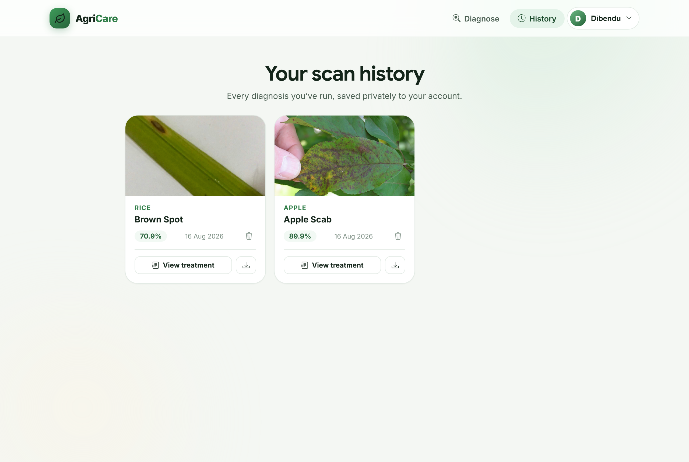
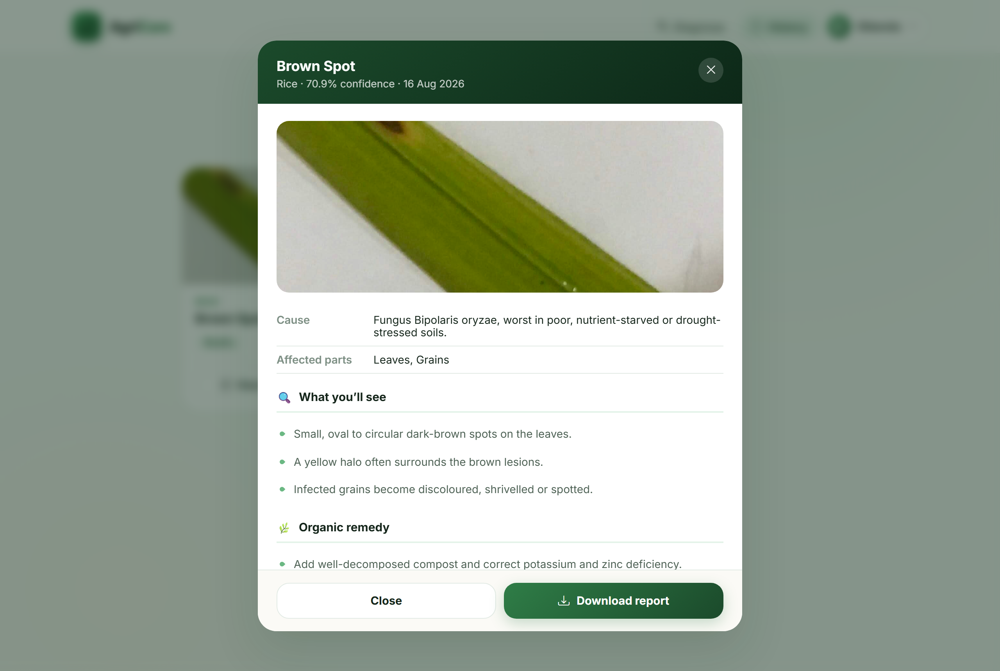
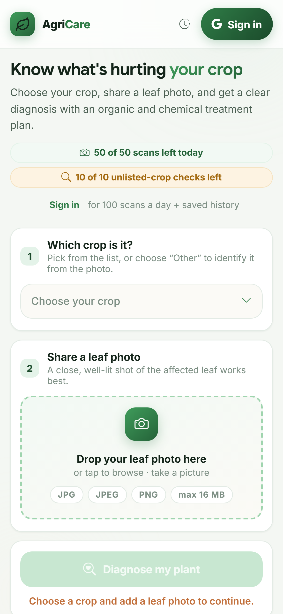
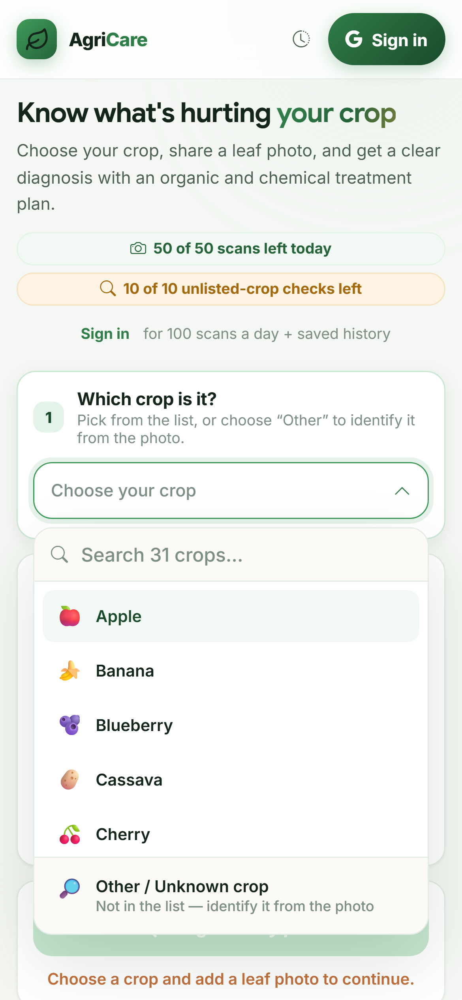
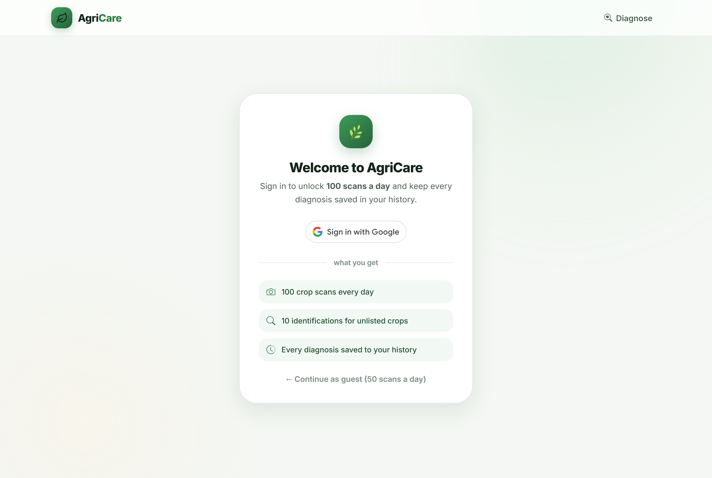

<div align="center">

# 🌿 Crop Disease Prediction

**Point a phone at a sick leaf. Get a diagnosis and a treatment plan you can act on today.**

Deep-learning crop disease detection across **31 crops** and **131 conditions**,
with organic *and* chemical treatment plans, per-user history, and PDF reports.

[](https://www.python.org/)
[](https://flask.palletsprojects.com/)
[](https://pytorch.org/)
[](https://supabase.com/)

</div>

---

## 📸 Screenshots

<table>
  <tr>
    <td width="50%"></td>
    <td width="50%"></td>
  </tr>
  <tr>
    <td align="center"><b>Home</b><br/><sub>Pick a crop, add a leaf photo</sub></td>
    <td align="center"><b>Crop picker</b><br/><sub>Search across 31 crops</sub></td>
  </tr>
  <tr>
    <td></td>
    <td></td>
  </tr>
  <tr>
    <td align="center"><b>Diagnosis</b><br/><sub>Confidence, symptoms, cause</sub></td>
    <td align="center"><b>Treatment plan</b><br/><sub>Organic + chemical, with doses</sub></td>
  </tr>
  <tr>
    <td></td>
    <td></td>
  </tr>
  <tr>
    <td align="center"><b>History</b><br/><sub>Every scan, saved per user</sub></td>
    <td align="center"><b>Saved plan</b><br/><sub>Re-open and export to PDF</sub></td>
  </tr>
</table>

<table>
  <tr>
    <td width="34%"></td>
    <td width="34%"></td>
    <td width="32%"></td>
  </tr>
  <tr>
    <td align="center"><b>Mobile</b></td>
    <td align="center"><b>Mobile picker</b></td>
    <td align="center"><b>Google Sign-In</b></td>
  </tr>
</table>

---

## 📋 Table of contents

- [Features](#-features)
- [AI/ML models](#-aiml-models)
- [Tech stack](#-tech-stack)
- [Architecture](#-architecture)
- [Project structure](#-project-structure)
- [Local setup](#-local-setup)
- [Configuration](#-configuration)
- [API reference](#-api-reference)
- [Data & accuracy](#-data--accuracy)
- [Troubleshooting](#-troubleshooting)

---

## ✨ Features

| | |
|---|---|
| 🌾 **31 crops, 131 conditions** | Apple, Rice, Corn, Tomato, Wheat, Tea, Cassava, Chilli, Mango, Sugarcane and more |
| 🧠 **Two-model cascade** | ViT-B/16 answers; EfficientNet-B3 takes over when confidence drops below 70% |
| 💊 **Real treatment plans** | Symptoms, cause, organic remedy, chemical spray with doses, spray timing, prevention, fertilizer support, safety |
| 🔍 **Unlisted crops** | Google Gemini Vision identifies crops outside the built-in list |
| 🔐 **Google Sign-In** | ID token verified server-side; no password to manage |
| 🗄️ **Per-user storage** | Each user gets a private Postgres schema in Supabase |
| 📄 **PDF export** | Download any diagnosis, including from saved history |
| 📱 **Responsive** | Verified on 10 device sizes, 320px → 1920px |
| 🔌 **Offline-capable** | The 31 listed crops run entirely on local models — no internet needed |
| 🛟 **Graceful degradation** | Supabase unreachable → falls back to SQLite instead of erroring |

---

## 🧠 AI/ML models

Two independently-trained checkpoints in a **confidence cascade**:

```
                     Leaf photo + chosen crop
                                │
                ┌───────────────┴───────────────┐
                ↓                               ↓
        crop from the list              "Other / Unknown crop"
                ↓                               ↓
      ┌──────────────────┐                Gemini Vision
      │   ViT-B/16-384   │  ← primary            │
      └────────┬─────────┘                       │
               ↓                                 │
      confidence ≥ 70% ?                         │
        ├── YES → this answer stands             │
        └── NO  → EfficientNet-B3 decides        │
               │                                 │
               └───────────────┬─────────────────┘
                               ↓
              Diagnosis + confidence + treatment plan
                               ↓
                 Saved to history · PDF export
```

| | ViT-B/16-384 | EfficientNet-B3 |
|---|---|---|
| **Role** | Primary | Backup (below threshold) |
| **Input** | 384 × 384 | 300 × 300 |
| **Classes** | 91 | 91 |
| **Params** | ~86 M | ~12 M |
| **Reported val. accuracy** | 96.2% | 98.7% |
| **Measured accuracy**¹ | 58.6% | 58.6% |
| **Avg. confidence when correct** | 75.7% | 61.8% |
| **CPU latency** | ~1.5 s | ~0.6 s |

¹ Crop-level top-1 on a 29-image benchmark where ground truth was established
**by eye before running either model**. The two tied exactly; ViT was made
primary because it is markedly more decisive when correct, which drives the
High/Medium/Low advisory shown to the user.

### Two label spaces, reconciled

The checkpoints were trained on **different datasets** that happen to both have
91 classes with **zero overlapping label names**. `backend/ensemble.py` projects
both onto a shared canonical `(crop, disease)` vocabulary:

- **131** canonical classes total
- **45** known to both models
- **46** ViT-only · **40** EfficientNet-only

> **Honest note on accuracy.** The 96–99% headline numbers are validation-set
> scores, almost certainly inflated by near-duplicate images across the
> train/val split — a known hazard with merged public crop datasets. Expect
> roughly **60%** crop-level accuracy on real phone photos. This is a decision
> aid, not a replacement for an agronomist, and the UI says so on low-confidence
> results.

---

## 🛠 Tech stack

**Backend** — Python 3.11 · Flask · PyTorch · timm · Pillow · psycopg2
**Frontend** — Jinja2 templates · vanilla JS (no framework) · custom CSS design system · jsPDF
**Database** — Supabase Postgres (schema-per-user) with SQLite fallback
**Auth** — Google Identity Services + `google-auth` server-side verification; bcrypt via Werkzeug
**AI services** — Google Gemini Vision (unlisted crops)

---

## 🏗 Architecture

```
┌──────────────────────────┐         ┌───────────────────────────────┐
│   FRONTEND               │  HTTPS  │   BACKEND (Flask)             │
│   Jinja templates        │ ──────► │                               │
│   vanilla JS + CSS       │  JSON   │   /api/detect-with-crop       │
│   jsPDF export           │ ◄────── │   /api/history  /api/me       │
└──────────────────────────┘         │   /auth/google                │
                                     └───────────┬───────────────────┘
                                                 │
                      ┌──────────────────────────┼───────────────────┐
                      ↓                          ↓                   ↓
            ┌──────────────────┐      ┌────────────────────┐  ┌─────────────┐
            │ PyTorch models   │      │ Supabase Postgres  │  │   Gemini    │
            │ ViT + EffNet     │      │ schema per user    │  │   Vision    │
            └──────────────────┘      └────────────────────┘  └─────────────┘
```

### Per-user data isolation

```
agricare.users                  ← registry: email, name, avatar, provider
├── user_<uuid-a>.detections    ← that user's scans, theirs alone
└── user_<uuid-b>.detections
```

Each account gets its **own Postgres schema**. Isolation is structural — a
history query can only reach the signed-in user's schema, so there is no
`WHERE user_id = …` that could be forgotten and leak data. The full report is
stored as `JSONB`, which is what lets history re-open a saved plan and export
it to PDF without re-running the model.

---

## 📁 Project structure

```
CropDiseasesPrediction/
├── README.md
├── .env.example              # template — copy to .env
├── .gitignore
├── start.bat · start.ps1     # one-command local launchers
│
├── backend/
│   ├── app.py                # Flask app: routes, quotas, prediction pipeline
│   ├── config.py             # every setting, read from .env
│   ├── ensemble.py           # model loading, cascade, label reconciliation
│   ├── model_store.py        # downloads checkpoints on a fresh host
│   ├── crops.py              # the 31-crop list (torch-free)
│   ├── db.py                 # storage layer (Postgres → SQLite fallback)
│   ├── auth.py               # sessions, password policy, reset tokens
│   ├── gemini_ai.py          # unlisted-crop identification
│   ├── requirements.txt
│   ├── models/               # checkpoints (git-ignored, see models/README.md)
│   ├── data/
│   │   ├── class_names.json         91 labels — EfficientNet space
│   │   ├── names (3).json           91 labels — ViT space
│   │   ├── disease_info.json        treatment plans (91)
│   │   └── disease_info_ext.json    treatment plans (49)
│   └── tools/                # offline maintenance scripts
│
├── frontend/
│   ├── templates/            # detect · history · auth · password reset
│   ├── static/css/app.css    # the whole design system
│   └── static/js/            # detect.js · report_pdf.js
│
├── docs/screenshots/
└── uploads/                  # user images (git-ignored)
```

---

## 🚀 Local setup

### 1. Clone and enter

```bash
git clone https://github.com/Dibendu094/CropDiseasesPrediction-.git
cd CropDiseasesPrediction-
```

### 2. Virtual environment

```bash
python -m venv venv
```

| Shell | Activate |
|---|---|
| PowerShell | `venv\Scripts\Activate.ps1` |
| CMD | `venv\Scripts\activate.bat` |
| Git Bash | `source venv/Scripts/activate` |
| Linux / macOS | `source venv/bin/activate` |

### 3. Install

```bash
pip install -r backend/requirements.txt
```

> **No GPU?** Save ~2 GB with the CPU-only PyTorch build — this project runs
> fine on CPU:
> ```bash
> pip install torch torchvision --index-url https://download.pytorch.org/whl/cpu
> ```

### 4. Add the model checkpoints

They are **not in the repo** (~1.1 GB, past GitHub's 100 MB file limit). Place
both files in `backend/models/` — see [`backend/models/README.md`](backend/models/README.md).

```
backend/models/
├── best_epoch_4_acc_98.70.pth     EfficientNet-B3  (~131 MB)
└── vit_b16_epoch_02 (2).pth       ViT-B/16-384     (~1.0 GB)
```

### 5. Configure

```bash
cp .env.example .env        # Windows: copy .env.example .env
```

Nothing is mandatory — it boots with defaults and stores data in local SQLite.

### 6. Run

```bash
python backend/app.py
```

Or use a launcher: `.\start.ps1` (PowerShell) / `start.bat` (CMD).

Open **<http://localhost:5000>**.

> ⏱ First start takes **40–60 s** while both checkpoints load. Wait for
> `Server is running!`. Predictions then take ~1.5–2 s each on CPU.

**Different port:** `PORT=5055 python backend/app.py`

> **One process serves everything.** Flask renders the frontend templates and
> serves its CSS/JS. There is no separate frontend server for local development.

---

## 🔑 Configuration

All settings are supplied through environment variables. The complete list —
with descriptions, defaults and safe placeholder values — lives in
**[`.env.example`](.env.example)**.

```bash
cp .env.example .env      # Windows: copy .env.example .env
```

Fill in your own credentials there. `.env` is git-ignored and must never be
committed.

> 🔐 Never paste real credentials into the README, an issue, or a commit.
> If a key is ever exposed, rotate it immediately in the provider's console.

## 📡 API reference

| Method | Route | Auth | Purpose |
|---|---|---|---|
| `GET` | `/` · `/detect` | — | The app (single page) |
| `GET` | `/history` | session | Saved scans |
| `POST` | `/api/detect-with-crop` | — | **Main endpoint** — `file` + `crop_selected` |
| `GET` | `/api/crops` | — | Crop list + feature flags |
| `GET` | `/api/me` | — | Current user + today's quota |
| `GET` | `/api/history` | session | Saved scans as JSON |
| `DELETE` | `/api/history/<id>` | session | Delete one scan |
| `GET` | `/api/diseases` | — | Full disease library |
| `POST` | `/auth/google` | — | Verify a Google ID token, start a session |
| `POST` | `/signup` · `/login` | — | Email + password auth |
| `GET` | `/logout` | — | Clear the session |

```bash
curl -X POST http://localhost:5000/api/detect-with-crop \
  -F "crop_selected=Rice" \
  -F "file=@leaf.jpg"
```

```json
{
  "success": true,
  "crop": "Rice",
  "disease": "Brown Spot",
  "confidence": 78.24,
  "confidence_level": "Medium",
  "symptoms": ["Small brown spots with grey centres", "..."],
  "organic_remedy": ["..."],
  "chemical_spray": ["Mancozeb 75% WP — 2.5 g per litre"],
  "preventive_measures": ["..."],
  "fertilizers": [{ "name": "Potash", "purpose": "..." }],
  "usage": { "scans_left": 99, "scans_limit": 100 }
}
```

Every `/api/` route answers with JSON — including errors — so the frontend never
parses an HTML error page.

---

## 📊 Data & accuracy

`disease_info.json` (91) + `disease_info_ext.json` (49) cover all 131 canonical
classes. Each entry carries: description · cause · symptoms · affected parts ·
organic remedy · chemical spray with doses · prevention · best time to spray ·
fertilizer support · safety tips.

**Audited** — all 140 entries were checked programmatically for:

| Check | Result |
|---|---|
| Banned/restricted pesticides (India, incl. 2018 order) | ✅ 0 found |
| Fungicide offered as a cure for a virus | ✅ 0 — all 12 viral entries prescribe vector control only |
| Wrong chemical class for the pathogen | ✅ 0 |
| Oomycetes given ineffective benzimidazoles | ✅ 0 — all use metalaxyl/cymoxanil/dimethomorph |
| Chemical spray on a healthy plant | ✅ 0 |
| Missing dose rate or safety guidance | ✅ 0 |

> ⚠️ **Doses are general guidance for Indian conditions.** Product registrations
> and approved rates change and differ by state. Always follow the label on the
> pack and confirm with your Krishi Vigyan Kendra before treating a large area.
> This caveat is shown in the app and included in every exported PDF.

---

## 🔧 Troubleshooting

**Analyze button greyed out** — it needs *both* a crop and a photo. The line
under the button says which is missing.

**`Postgres unavailable — could not translate host name`** — Supabase retired
the `db.<ref>.supabase.co` hostnames. Use the pooler: host
`aws-0-<region>.pooler.supabase.com`, port **6543**, user
`postgres.<project-ref>`.

**Google button missing** — `GOOGLE_CLIENT_ID` unset, or `http://localhost:5000`
isn't in your Google Cloud Console origins. Changes take a few minutes to propagate.

**Gemini says the model is unavailable** — Google retires model ids. Pick a
current one in AI Studio and update `GEMINI_MODEL`.

**CSS/JS changes don't show** — hard refresh (`Ctrl+Shift+R`); static files are
cached aggressively.

---

## 👤 Author

**Dibendu Mondal** · [@Dibendu094](https://github.com/Dibendu094)
RCC Institute of Information Technology

## 📄 License

Released for academic and educational use. Trained on merged public
crop-disease datasets (PlantVillage and similar). Treatment guidance is compiled
for general Indian agricultural practice — verify locally before large-scale
application.

<div align="center"><sub>Built for farmers 🌾</sub></div>
